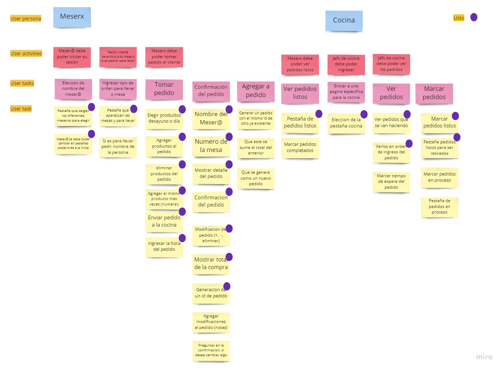

# Spooky Burger 
Aplicación Web, responsive para la intefaz de menú de un restaurant temático llamado Spooky Burger.
En la aplicación se puede elegir la opción de la cocina o de toma de pedidos. En la toma de pedidos podemos elegir el mesere, mesa y luego los ir a la elección de los items de la orden, esta es luego enviada a la pestaña de la cocina que contiene los pedidos, los cuales puede, la cocina, identificar como listos o aun en espera de su preparación. 

## Herramientas
[][tech_tools_anchor]
&nbsp;
[][tech_tools_anchor]
&nbsp;
[][tech_tools_anchor]
&nbsp;
[][tech_tools_anchor]
&nbsp;
[][tech_tools_anchor]
&nbsp;
[][tech_tools_anchor]
&nbsp;
[][tech_tools_anchor]
&nbsp;
[][tech_tools_anchor]

## Organización
Se recibieron 3 historias de usuarios con las cuales se construyo un *User Story Mapping*. 

- Se dividieron a los usuarios de la aplicación en personal mesere y personal de cocina. 
- Se identificaron las diferentes paginas necesarias para la aplicación (Home, elección mesere o mesa, elección de items del menú, ver los pedidos ya hechos)
- Se separaron las diferentes actividades de los usuarios para poder asi obtener las diferentes tareas dependiendo de la actividad, además de dividir las tareas en pequeños objetivos con los cuales cumplir de a poco. 

Click aquí para revisar las Historias de Usuario

__[HU 1] Mesero/a debe poder tomar pedido de cliente__

Yo como meserx quiero tomar el pedido de un cliente para no depender de mi mala
memoria, para saber cuánto cobrar, y enviarlo a la cocina para evitar errores y
que se puedan ir preparando en orden.

_Criterios de aceptación_

Lo que debe ocurrir para que se satisfagan las necesidades del usuario)

* Anotar nombre de cliente.
* Agregar productos al pedido.
* Eliminar productos.
* Ver resumen y el total de la compra.
* Enviar pedido a cocina (guardar en alguna base de datos).
* Se ve y funciona bien en una _tablet_

__[HU 2] Jefe de cocina debe ver los pedidos__

Yo como jefx de cocina quiero ver los pedidos de los clientes en orden y
marcar cuáles están listos para saber qué se debe cocinar y avisar a lxs meserxs
que un pedido está listo para servirlo a un cliente.

_Criterios de aceptación_

* Ver los pedidos ordenados según se van haciendo.
* Marcar los pedidos que se han preparado y están listos para servirse.
* Ver el tiempo que tomó prepara el pedido desde que llegó hasta que se
  marcó como completado.

__[HU 3] Meserx debe ver pedidos listos para servir__

Yo como meserx quiero ver los pedidos que están preparados para entregarlos
rápidamente a los clientes que las hicieron.

_Criterios de aceptación_

* Ver listado de pedido listos para servir.
* Marcar pedidos que han sido entregados.

## Accesibilidad 
Se utilizaron varias herramientas para poder ayudar que la aplicación tuviera mayor accesibilidad. 
- [Tota11y](https://khan.github.io/tota11y/) - Khan Academy. Toolkid que permite revisar ciertos elementos de la página como contraste de color, headings, entre otros.
- [axe DevTools](https://www.deque.com/axe/devtools/) - Toolkit que al igual que Tota11y revisa diferentes elementos de la página para tener la mejor cobertura de problemas de accesibilidad. 
- [eslint-plugin-jsx-a11y](https://github.com/jsx-eslint/eslint-plugin-jsx-a11y) - Eslint pluging para revisar reglas especificas para la accesibilidad en proyectos que utilizan jsx. 
- Uso de Screen Readers para poder enterder su función y como estos leen la página Web. 

## Test de usabilidad
[Test de usabilidad para Spooky Burger](https://www.loom.com/share/aec36cfec60d4206b1355fa2e7924a26)
Algunos comentarios fueron:
- Agregar una forma de eliminar el pedido una vez en la pestaña de cocina.
- Edición del pedido en la pestaña de cocina.
- Por si hay una equivocación al apretar botón de pedido listo que se pueda clickear nuevamente para poder dejarlo como en espera.
- Que se puedan retirar los pedidos, a otra pestaña tal vez, cuando esten listos. 

Todos lo comentarios son cosas que se pueden seguir iterando para mejorar la aplicación. 

[tech_tools_anchor]: #tool-anchor--